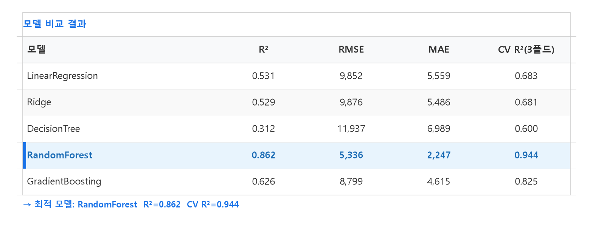
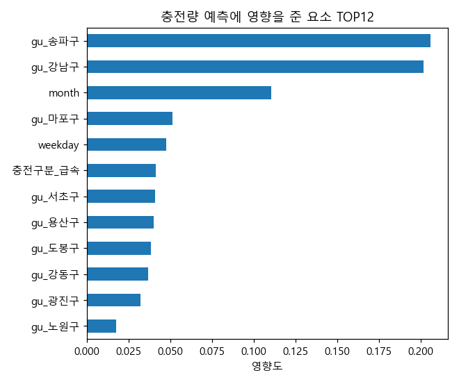
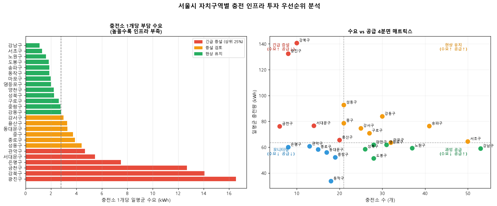

# ⚡ SeoulEVCheck — 서울 전기차 충전 인텔리전스

> 서울시 전기차 충전 데이터로 **수요를 예측하고(ML·DL), 그 예측으로 충전 운영을 권고하는(LLM)** 데이터 인텔리전스 프로젝트

한국전력공사 공공데이터 **63만 건**의 충전 세션을 분석해, 자치구·충전소 단위의 충전 수요를 예측합니다. 한 주제를 3주에 걸쳐 **ML → DL → LLM** 으로 점진 확장하는 머신러닝 심화 개인 프로젝트입니다.


<br>

## 🎯 프로젝트 개요

전기차 보급이 급증하면서 충전 인프라의 **수요 예측·관리** 필요성이 커지고 있습니다. 충전 수요를 지역·시간대별로 예측하면 ① 충전 인프라 투자 효율, ② 전력 부하 관리(에너지 절감), ③ 충전소 운영 최적화에 활용할 수 있습니다.

> **향후 비전** — 예측 수요 기반 이동형 **'배달충전'** 배치 의사결정 → 자율주행 전기차 시대, 예측 수요에 따라 충전 차량이 스스로 고수요 지역으로 이동하는 **무인 충전 서비스의 '두뇌'** 로 확장. *(자율주행은 비전이며 본 과제의 구현 범위는 아님)*

<br>

## 🗺 3주 로드맵

| 주차 | 단계 | 내용 | 핵심 기술 | 상태 |
|---|---|---|---|---|
| **1주** | ML | 충전 수요 예측 (자치구·충전소 단위) | RandomForest · XGBoost 회귀 | ✅ 완료 |
| **2주** | DL | 충전 수요 시계열 예측 | LSTM | ⏳ 예정 |
| **3주** | LLM & RAG | 충전 어드바이저 (운영 권고 + 정책 Q&A) | RAG · LLM | ⏳ 예정 |

각 주차는 **독립 발표 + 독립 제출**이며, 데이터·앱·레포는 공유하면서 매주 확장합니다.

<br>

## 📊 데이터

**출처:** 한국전력공사 \_ 서울시 전기차 충전소 충전량 (공공데이터포털)

| 항목 | 값 |
|---|---|
| 행(세션) | 638,702 / 충전소 ~625개 / 고유주소 611개 |
| 컬럼(9) | 충전구분 · 충전소명 · 주소 · 충전기용량 · **충전량(타깃)** · 충전시간 · 충전분 · 충전시작시각 · 충전종료시각 |
| 타깃 | 충전량(kWh) 일별/월별 집계 |

**파생 변수:** 주소 → 자치구(추출률 98.5%), 충전시작시각 → 요일·월·시간대
**전처리:** null 주소 8,201세션 제거 · 오타 정제 · 날짜 범위 필터 · **누수 컬럼(충전시간/분) 제외**

<br>

## 🏆 Week 1 — 결과 (ML)

자치구(거시)·충전소(미시) 두 단위로 독립 모델을 학습했습니다.

| 모델 | 단위 | 기준모델 R² | **AI 모델 R²** | CV R²(3-fold) | RMSE(kWh) |
|---|---|---|---|---|---|
| **RandomForest** | 자치구(거시) | 0.277 | **0.940** ★ | 0.951 ± 0.007 | 2,533 |
| LinearRegression | 충전소(미시) | 0.083 | 0.058 | 0.369 ± 0.050 | 277 |

- **자치구 모델**: RandomForest가 R²=0.940으로 충전량 변동의 **94%를 설명**. 이상치 9건 제거로 R² 0.862 → 0.940 향상.
- **실데이터 검증**: 2025년 데이터로 학습한 모델이 **2026년 1~3월 실제 충전량을 R²=0.806** 수준으로 예측 → 일반화 성능 확인.
- **충전소 모델**: 미시 단위 노이즈가 커 회귀 R²는 낮으나, **핫스팟 랭킹(TOP-N)** 용도로는 안정적으로 활용.

### 모델 비교


### 특성 중요도 (자치구 모델)


### 인프라 수요-공급 갭 분석


<br>

## 🧱 프로젝트 구조

```
SeoulEVCheck/                    한 프로젝트, 3주 점진 확장
├── data/                        공유: 한전 충전 데이터(원본 .gitignore)
├── notebooks/                   제출용 노트북 (week1_ml.ipynb …)
├── src/
│   ├── common/                  공유 유틸 (로더 · 구 추출 · 전처리)
│   ├── ml/                      1주 — 전처리 · EDA · 모델 · 리포트
│   ├── dl/                      2주 — LSTM (예정)
│   └── llm/                     3주 — 어드바이저 · RAG (예정)
├── models/                      학습 모델 (.pkl — 클라우드 데모용 커밋)
├── app/SeoulEVCheck.py          Streamlit 앱 (1개, 매주 확장)
├── reports/figures/             EDA · 결과 시각화
├── docs/PRD_SeoulEVCheck_Ver2.0.md   상세 기획서
└── requirements.txt · README.md
```

<br>

## 🚀 실행 방법

```bash
# 1) 가상환경
python -m venv venv
source venv/Scripts/activate      # Windows
# source venv/bin/activate        # macOS/Linux

# 2) 의존성 설치
pip install -r requirements.txt

# 3) 모델 학습 (Week 1)
python src/ml/model.py

# 4) Streamlit 앱 실행
streamlit run app/SeoulEVCheck.py
```

**Streamlit 앱 기능 (1주):** 자치구·충전기·요일·시간대 입력 → 예상 충전량 + 구별 수요 지도 + 충전소 핫스팟 TOP-N

<br>

## 🛠 기술 스택

| 영역 | 사용 기술 |
|---|---|
| 언어 | Python 3 |
| 데이터 | pandas · numpy · openpyxl |
| 모델 | scikit-learn (RandomForest 등) · XGBoost · joblib |
| 시각화 | matplotlib · seaborn · plotly |
| 앱/배포 | Streamlit · Streamlit Cloud |

<br>

## 📄 문서

- 📋 [상세 기획서 (PRD Ver2.0)](docs/PRD_SeoulEVCheck_Ver2.0.md) — 3주 로드맵 · 데이터 명세 · 모델 설계 · 수용 기준

<br>

> 머신러닝 심화 3주 커리큘럼 · 개인 프로젝트 | 담당: **오영석**
